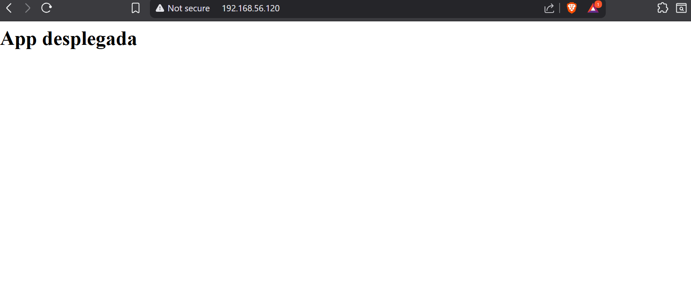
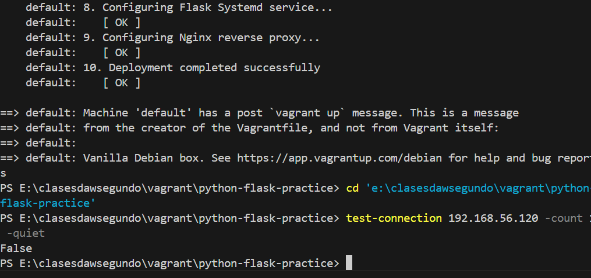
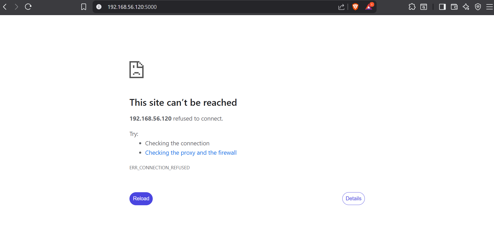

# Python Flask Application Deployment with Gunicorn and Nginx

**Author:** Mario Acosta Vargas
**Date:** January 2026
**Version:** 1.5.3

## Project Description

This project automates the deployment of the **Azure Samples Python Flask Web App** ("Ampliación" Task). The environment is provisioned on a **Debian Bullseye** virtual machine managed by **Vagrant**.

The deployment architecture follows production best practices:

- **Nginx**: Web Server and Reverse Proxy (Port 80).
- **Gunicorn**: WSGI Application Server (Unix Socket & Port 5000).
- **Python Flask**: The web application (cloned from Azure Samples).
- **Systemd**: Service management to ensure the application starts automatically.

The entire installation and configuration process is **automatic** thanks to the `bootstrap.sh` script, which clones the repository and installs dependencies.

## Requirements

- Vagrant
- VirtualBox

## Project Structure

```
python-flask-practice/
│
├── Vagrantfile              # Virtual Machine Configuration
├── config/
│   ├── assets/              # Screenshots
│   ├── bootstrap.sh         # Provisioning Script
│   ├── application.py       # Base Flask Application Code
│   ├── wsgi.py              # WSGI Entry Point
│   ├── .env                 # Environment Variables
│   ├── flask_app.service    # Systemd Service Unit
│   └── app.conf             # Nginx Site Configuration
└── readme.md
```

## Deployment Instructions

1.  **Start the virtual machine:**

    ```bash
    vagrant up
    ```

    The provisioning script will automatically install Python, Pipenv, Nginx, and configure all services.

2.  **Verify the deployment:**
    Access from your browser:
    http://192.168.56.120

    You should see the message: **"App deployed"**.

## Screenshots

### 1. Home Screen (Web Working)

The application is correctly accessible via Nginx on port 80.


### 2. Installation Process (Terminal)

The `bootstrap.sh` script shows progress step-by-step.


### 3. Security (Port 5000 Closed)

Port 5000 (Gunicorn direct) is closed to the outside for security, as communication is handled via Unix Socket.


## Useful Commands

If you need to access the machine to inspect logs or services:

```bash
vagrant ssh
```

View service status:

```bash
sudo systemctl status flask_app
sudo systemctl status nginx
```
